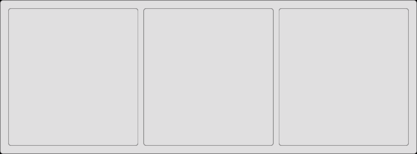

# Fugl.jl

[](https://erikbuer.github.io/Fugl.jl/dev/)

`Fugl.jl` is a functional GUI library written in Julia using OpenGL.

It is intended to be a simple library with few dependencies, suitable for making engineering applications.

Fugl has a short distance from component to shader, enabling fast and intuitive user interfaces.


## Simple Funcitonal API

```julia
using Fugl

function MyApp()
    Container(
        Row(
            Container(),
            Container(),
            Container(),
        )
    )
end

# Run the GUI:
# Fugl.run(MyApp, title="Fugl Demo", window_width_px=812, window_height_px=300, fps_overlay=true)

screenshot(MyApp, "row.png", 812, 300);
```



## Real-Time Performance

Fugl is written with real-time applications in mind.


## Demo Application


