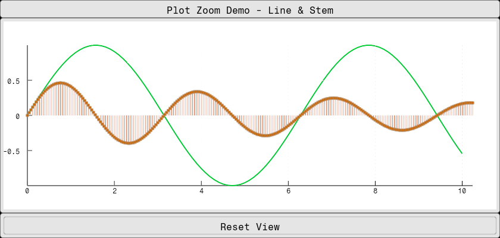

# Fugl.jl

[](https://erikbuer.github.io/Fugl.jl/dev/)

`Fugl.jl` is a functional GUI library written in Julia using OpenGL.

It is intended to be a simple library with few depencdencies, suitable for making scientific applications.

`Fugl.jl` has a short distance from component to shader, enabling fast and intuitive user interfaces.

## Example

```julia
using Fugl
using Fugl: Text, TextButton

# Create plot data
time_data = collect(0.0:0.1:10.0)
y_data = sin.(time_data)

# Create stem plot data with 256 points
stem_x = collect(0.0:0.04:10.24)  # 256 points from 0 to ~10.24
stem_y = 0.5 * sin.(stem_x * 2) .* exp.(-stem_x * 0.1)  # Damped sine wave

# Create plot elements
elements = AbstractPlotElement[
    LinePlotElement(
        y_data;
        x_data=time_data,
        color=Vec4{Float32}(0.0, 0.8, 0.2, 1.0),  # Green
        width=3.0f0,
        line_style=SOLID,
    ),
    StemPlotElement(
        stem_y;
        x_data=stem_x,
        line_color=Vec4{Float32}(0.8, 0.2, 0.0, 1.0),    # Red stems
        fill_color=Vec4{Float32}(0.8, 0.4, 0.0, 1.0),    # Orange markers
        border_color=Vec4{Float32}(0.4, 0.1, 0.0, 1.0),  # Dark red border
        line_width=1.5f0,
        marker_size=3.0f0,
        border_width=0.5f0,
        marker_type=CIRCLE,
        baseline=0.0f0,
    )
]

# Create plot state for zoom control
plot_state = Ref(PlotState())

# Define plot style (visual appearance only)
plot_style = PlotStyle(
    show_grid=true,
    show_axes=true,
    show_legend=true
)

function MyApp()
    IntrinsicColumn([
            IntrinsicHeight(Container(Text("Plot Zoom Demo - Line & Stem"))),

            # Plot with user-managed state - much simpler!
            Container(
                Plot(
                    elements,               # Elements are passed directly
                    plot_style,             # Style for visual appearance
                    plot_state[],           # State only contains bounds and zoom
                    (new_state) -> plot_state[] = new_state
                )
            ),

            # Simple reset button
            IntrinsicHeight(Container(
                TextButton(
                    "Reset View";
                    on_click=() -> begin
                        plot_state[] = PlotState()  # Reset to auto-scale
                    end
                )
            ))
        ], padding=0.0, spacing=0.0)
end

# Run the GUI:
# Fugl.run(MyApp, title="Plot Zoom Demo", window_width_px=800, window_height_px=600, fps_overlay=true)

screenshot(MyApp, "plot_example.png", 840, 400);
nothing #hide
```


