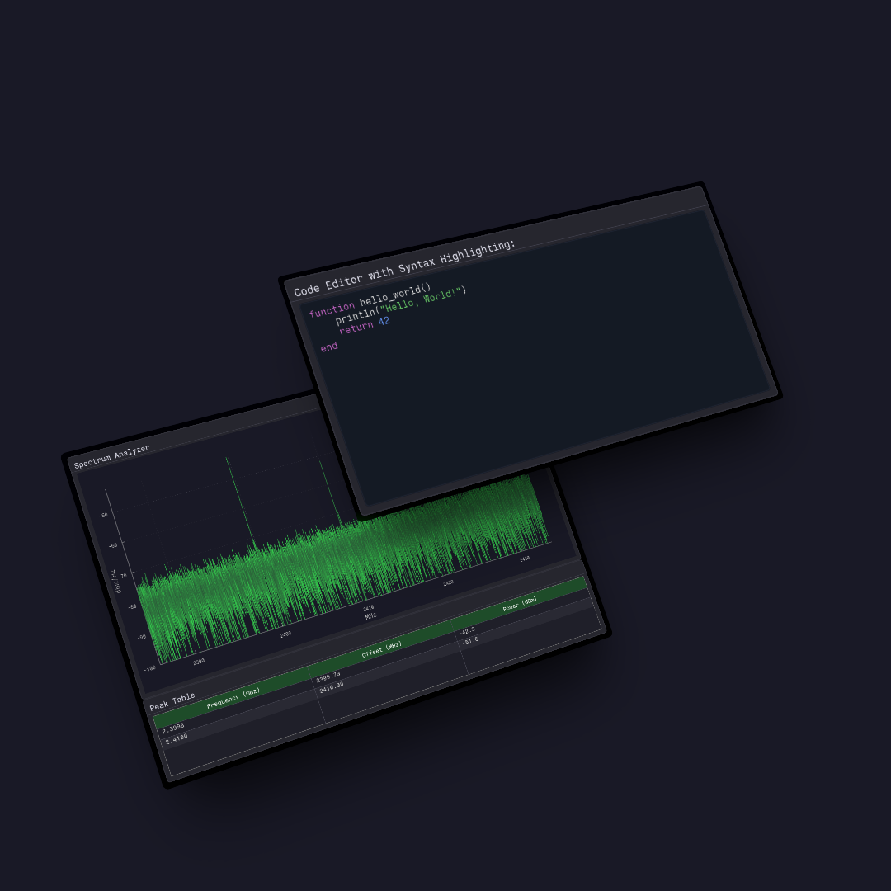

# Fugl.jl

`Fugl.jl` is a functional GUI library written in Julia using OpenGL.

It is intended to be a simple library with few depencdencies, suitable for making scientific applications.

`Fugl.jl` has a short distance from component to shader, enabling fast and intuitive user interfaces.

